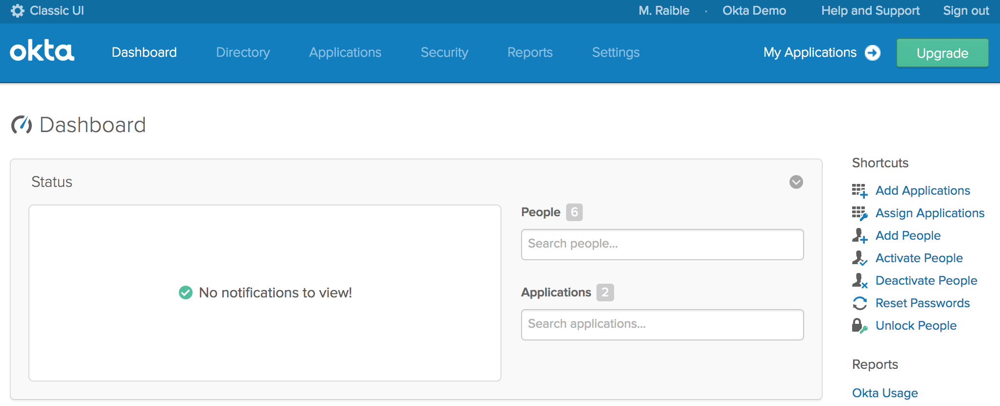
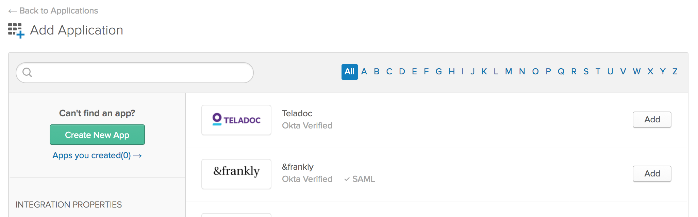

# SCROE Chatbot

This is an example chatbot demonstrating how to build AI assistants for financial services and banking. This starter pack can be used as a base for your own development or as a reference guide for implementing common banking-industry features with Rasa. It includes pre-built intents, actions, and stories for handling conversation flows like checking spending history and transferring money to another account.


**Table of Contents**

- [SCROE Chatbot](#scroe-chatbot)
  - [Rasa Installations](#rasa-installations)
    - [Creating a virtual environment:](#creating-a-virtual-environment)
    - [Install Project dependencies:](#install-project-dependencies)
    - [Download the Language Models](#download-the-language-models)
    - [Installing and running Duckling](#installing-and-running-duckling)
  - [Run the Chatbot](#run-the-chatbot)
    - [Start the SCROE Chatbot](#start-the-scroe-chatbot)
    - [Test the SCROE Chatbot](#test-the-scroe-chatbot)
  - [Language Models:](#language-models)
  - [NLU Pipelines:](#nlu-pipelines)
  - [Overview of the files](#overview-of-the-files)
  - [RASA X Installation](#rasa-x-installation)
  - [Rasa Chat Widget 1](#rasa-chat-widget-1)
  - [Rasa Chat Widget 2](#rasa-chat-widget-2)
  - [Spring Boot, SAML, and Okta](#spring-boot-saml-and-okta)
  - [Getting Started](#getting-started)
    - [Create a SAML App in Okta](#create-a-saml-app-in-okta)
    - [Run the App and Login with Okta](#run-the-app-and-login-with-okta)
  - [Links](#links)
  - [Help](#help)
  - [License](#license)


## Rasa Installations

### Creating a virtual environment:
It is advisable to create a virtual environment to to avoid version mismatch issues.

**Windows 10:**
1) Create and switch to the project directory:
```bash
mkdir scroe-chatbot
cd scroe-chatbot
```
2) Create and activate virtual environment named ‘myenv’ using Anaconda prompt:
```bash
conda create --name myenv
conda activate myenv
```
3) Install required libraries:
```bash
#for python version 3.7.x
conda install ujson
conda install tensorflow
```
4) Install Rasa:
```bash
pip install rasa==2.4.0 
```
5) Clone the repo:
```bash
git clone ‘bitbucket repo’
cd ‘bitbucket repo’
```

**Linux:**
1) Creating a new directory named venv: 
```bash
python3 -m venv ./venv
```
2) Activating the virtual environment:
```bash
source ./venv/bin/activate
```
3) Install required libraries:
```bash
#for python version 3.7.x
pip install ujson
pip install tensorflow
```
4) Install Rasa:
```bash
pip install rasa==2.4.0 
```
5) Clone the repo:
```bash
git clone ‘bitbucket repo’
cd ‘bitbucket repo’
```


### Install Project dependencies:
Run:
```bash
pip install -r requirements.txt
```

To install development dependencies:

```bash
pip install -r requirements-dev.txt
pre-commit install
python -m spacy download en_core_web_md en
python -m spacy link en_core_web_md en
```


### Download the Language Models
**For `spaCy`**
1) Download the model:
```bash
python3 -m spacy download en_core_web_md
```
OR
```bash
#spaCy link
```
2) Link the model
```bash
python3 -m spacy link en_core_web_md en
```

**For BERT:**

Install the Transformers library using:
```bash
pip install transformers
```


### Installing and running Duckling
Duckling is a pre-trained model which is used to extract amounts of money, numbers, and dates.

It runs as a separate service, in its own container or server.

1) Pull `rasa/duckling` docker image:
```bash
docker pull rasa/duckling
```
2) Run the `duckling` server in a new terminal window:
```bash
docker run -p 8000:8000 rasa/duckling
```
3) We will point to this address instead of localhost in our `config.yml` file:
```bash
  - name: DucklingEntityExtractor
    url: http://duckling.rasa.com:8000
    dimensions:
    - amount-of-money
    - time
    - number
```


## Run the Chatbot

### Start the SCROE Chatbot
To run the chatbot.
1) Train the model:
```bash
rasa train
```
2) Start the Rasa open source server on port 5005:
```bash
rasa shell -p 5005
```
3) Start the action server in a new terminal window:
```bash
rasa run actions --port 5056
```


### Test the SCROE Chatbot
To test the chatbot.
1) Run through test conversations to make sure that both NLU and Core make correct predictions:
```bash
rasa test
```
2) Split data into a test set or estimate how well your model generalizes using cross-validation:
```bash
rasa test nlu -u data/nlu.md --config config.yml --cross-validation
```
3) Comparing multiple NLU Pipeline Configurations:
```bash
rasa test nlu --nlu data/nlu.yml --config config_1.yml config_2.yml config3.yml
```


## Language Models:
The language models that were considered for our chatbot are:
<ul>
<li>Spacy NLP</li>
<li>BERT</li>
<li>Roberta</li>
</ul>


## NLU Pipelines:
The 4 NLU Pipeline configurations considered are:

1) `config.yml`:
```bash
version: "2.0"
language: en
pipeline:
  - name: WhitespaceTokenizer
  - name: RegexFeaturizer
  - name: LexicalSyntacticFeaturizer
  - name: CountVectorsFeaturizer
  - name: CountVectorsFeaturizer
    analyzer: "char_wb"
    min_ngram: 1
    max_ngram: 4
  - name: DIETClassifier
    epochs: 100
  - name: FallbackClassifier
    threshold: 0.7
  - name: DucklingEntityExtractor
    url: http://duckling.rasa.com:8000
    dimensions:
    - amount-of-money
    - time
    - number
  - name: SpacyNLP
    model: "en_core_web_md"
    case_sensitive: false
  - name: "SpacyEntityExtractor"
    # Note: It is not possible to use the SpacyTokenizer + SpacyFeaturizer in 
    #       combination with the WhitespaceTokenizer, and as a result the
    #       PERSON extraction by Spacy is not very robust.
    #       Because of this, the nlu training data is annotated as well, and the
    #       DIETClassifier will also extract PERSON entities.
    dimensions: ["PERSON"]
  - name: EntitySynonymMapper
policies:
- name: AugmentedMemoizationPolicy
- name: TEDPolicy
  epochs: 40
- name: RulePolicy
  core_fallback_threshold: 0.4
  core_fallback_action_name: "action_default_fallback"
  enable_fallback_prediction: True
```
2) `config-spacy.yml`:
```bash
version: "2.0"
language: en
pipeline:
  - name: SpacyNLP
  - name: SpacyTokenizer
  - name: SpacyFeaturizer
  - name: RegexFeaturizer
  - name: LexicalSyntacticFeaturizer
  - name: CountVectorsFeaturizer
  - name: CountVectorsFeaturizer
    analyzer: "char_wb"
    min_ngram: 1
    max_ngram: 4
  - name: DIETClassifier
    epochs: 100
  - name: EntitySynonymMapper
  - name: ResponseSelector
    epochs: 100
policies:
- name: AugmentedMemoizationPolicy
- name: TEDPolicy
  epochs: 40
- name: RulePolicy
  core_fallback_threshold: 0.4
  core_fallback_action_name: "action_default_fallback"
  enable_fallback_prediction: True
```
3)  `config-bert.yml`:
```bash
version: "2.0"
language: en
pipeline:
  - name: WhitespaceTokenizer
  - name: LanguageModelFeaturizer
    model_name: "bert"
    model_weights: "rasa/LaBSE"
  - name: DIETClassifier
    epochs: 100
  - name: FallbackClassifier
    threshold: 0.7
  - name: DucklingEntityExtractor
    url: http://duckling.rasa.com:8000
    dimensions:
    - amount-of-money
    - time
    - number
  - name: EntitySynonymMapper
  - name: ResponseSelector
    epochs: 100
policies:
- name: AugmentedMemoizationPolicy
- name: TEDPolicy
  epochs: 40
- name: RulePolicy
  core_fallback_threshold: 0.4
  core_fallback_action_name: "action_default_fallback"
  enable_fallback_prediction: True
```
4)  `config-roberta.yml`:
```bash
version: "2.0"
language: en
pipeline:
  - name: WhitespaceTokenizer
  - name: LanguageModelFeaturizer
    model_name: "RoBERTa"
    model_weights: "roberta-base"
  - name: DIETClassifier
    epochs: 100
  - name: FallbackClassifier
    threshold: 0.7
  - name: DucklingEntityExtractor
    url: http://duckling.rasa.com:8000
    dimensions:
    - amount-of-money
    - time
    - number
  - name: EntitySynonymMapper
  - name: ResponseSelector
    epochs: 100
policies:
- name: AugmentedMemoizationPolicy
- name: TEDPolicy
  epochs: 40
- name: RulePolicy
  core_fallback_threshold: 0.4
  core_fallback_action_name: "action_default_fallback"
  enable_fallback_prediction: True
```


## Overview of the files

`data/nlu/nlu.yml` - contains NLU training data

`data/nlu/rules.yml` - contains rules training data

`data/stories/stories*.yml` - contains stories training data

`actions.py` - contains custom action/api code

`domain.yml` - the domain file, including bot response templates

`config.yml` - training configurations for the NLU pipeline and policy ensemble

`tests/` - end-to-end tests


## RASA X Installation
Rasa x installation -VDI(hrishikesh) - tar file - pip install
Ujson wheel file - pip install

Rasa run actions
Rasa x


## Rasa Chat Widget 1
**REST Channel:**
This UI can be used in any website to run Rasa chatbot.
Add the index.html file, css and js folders in the rasa project folder and make the mentioned changes.

Steps:
1) Since this Chat UI communicates with the Rasa server using `rest` channel, make sure you have added `rest` channel in the `credentials.yml` file
2) Once you have developed your bot and you are ready to integrate the bot with the UI, you can start the Rasa server using the below command:
```bash
rasa run -m models --enable-api --cors "*"
```
3) Add the Website Name or Website IP (localhost) in "js/script.js" file:
```bash
http://localhost:5005/webhooks/rest/webhook
```


## Rasa Chat Widget 2
**SOCKET.IO:**
Steps
1) Add the below configuration in the credentials.yml file:
```bash
socketio:
  user_message_evt: user_uttered
  bot_message_evt: bot_uttered
  session_persistence: true
```
2) Start the bot using the below command:
```bash
rasa run -m models --enable-api --cors "*" --debug
```
3) Create a webpage and add the code from the chat widget in the body tag of your web page.
4) Now change the socket url port number to our rasa server's port number:
```bash
url: http://localhost:5005/
```

## Spring Boot, SAML, and Okta

A Spring Boot example app that shows how to implement single sign-on (SSO) with Spring Security's SAML DSL and Okta.

Please read [Get Started with Spring Boot, SAML, and Okta](https://developer.okta.com/blog/2017/03/16/spring-boot-saml) to see how this app was created.

**Prerequisites:** [Java 8](http://www.oracle.com/technetwork/java/javase/downloads/jdk8-downloads-2133151.html).

> [Okta](https://developer.okta.com/) has Authentication and User Management APIs that reduce development time with instant-on, scalable user infrastructure. Okta's intuitive API and expert support make it easy for developers to authenticate, manage and secure users and roles in any application.

* [Getting Started](#getting-started)
* [Links](#links)
* [Help](#help)
* [License](#license)

## Getting Started

To install this example application, run the following commands:

```bash
git clone https://github.com/oktadeveloper/okta-spring-boot-saml-example.git
cd okta-spring-boot-saml-example
```

This will get a copy of the project installed locally. To install all of its dependencies and start the app, run:
 
```bash
./mvnw spring-boot:run
```

### Create a SAML App in Okta

The first thing you'll need to do is create an Okta account at [okta.com/integrate/signup](https://www.okta.com/integrate/signup/). After activating your account, log in to it. If you just created an account, you'll see a screen similar to the one below.


 
Click on **< > Developer Console** in the top-left corner and switch to the Classic UI. If you see a screen like the following, you're good to go! The reason you need to use the Classic UI for this tutorial is because we haven't yet added SAML support to the [Developer Console](/blog/2017/09/25/all-new-developer-console).



Click **Add Applications** in the top right to continue. This will bring you to a screen with a **Create New App** green button on the left.



Click the button and choose **Web** for the platform and **SAML 2.0** for the sign on method.


Click the **Create** button. The next screen will prompt you for an application name. I used "Spring SAML”, but any name will work.


Click the **Next** button. This brings you to the second step, configuring SAML. Enter the following values:

* Single sign on URL: `https://localhost:8443/saml/SSO`
* Audience URI: `https://localhost:8443/saml/metadata`


Scroll to the bottom of the form and click **Next**. This will bring you to the third step, feedback. Choose "I'm an Okta customer adding an internal app” and optionally select the App type.


Click the **Finish** button to continue. This will bring you to the application's "Sign On” tab which has a section with a link to your applications metadata in a yellow box. Copy the **Identity Provider metadata** link as you'll need it to configure your Spring Boot application.


The final setup step you'll need is to assign people to the application. Click on the **Assignments** tab and the **Assign** > **Assign to People** button. You'll see a list of people with your account in it.


Click the **Assign** button, accept the default username (your email), and click the **Done** button.

Update `src/main/resources/application.properties`, to have the `metadata-url` for the app you just created. Make sure to use the "Identity Provider metadata" value you copied earlier (hint: you can find it again under the "Sign On” tab in your Okta application).

```properties
server.port = 8443
server.ssl.enabled = true
server.ssl.key-alias = spring
server.ssl.key-store = classpath:saml/keystore.jks
server.ssl.key-store-password = secret

security.saml2.metadata-url = <your metadata url>
```

### Run the App and Login with Okta

Start the app using your IDE or `mvn spring-boot:run` and navigate to `https://localhost:8443`. If you're using Chrome, you'll likely see a privacy error.


Click the "ADVANCED" link at the bottom. Then click the "proceed to localhost (unsafe)” link.


Next, you'll be redirected to Okta to sign in and redirected back to your app. If you're already logged in, you won't see anything from Okta. If you sign out from Okta, you'll see a login screen such as the one below.


After you've logged in, you should see a screen like the one below.


## Links

This example uses [Spring Security SAML DSL](https://github.com/spring-projects/spring-security-saml-dsl) to integrate with Okta. Kudos to the project's [spring-security-saml-dsl-sample for its instructions](https://github.com/spring-projects/spring-security-saml-dsl/blob/master/samples/spring-security-saml-dsl-sample/README.md).

## Help

Please post any questions as comments on the [blog post](http://developer.okta.com/blog/2017/03/16/spring-boot-saml), or visit our [Okta Developer Forums](https://devforum.okta.com/). You can also email developers@okta.com if would like to create a support ticket.

## License

Apache 2.0, see [LICENSE](LICENSE).

